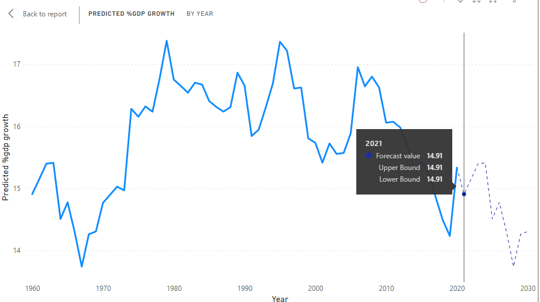

# Analysis-of-Effect-Of-Pandemic-on-Futute-Investment-and-GDP-using-ML-and-PowerBi-
A comprehensive overview of the effect of the pandemic on the various aspects of Global Finance.

<H1>GDP DROWTH ANALYSIS</H1>

 
   
   
   
   
 
  

  

